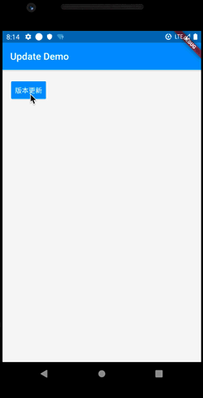

# flutter_app_update_example

演示如何使用现有的flutter插件实现应用内的版本更新功能。

## 关于我

            

---

## 演示

## 插件使用

* [flutter_update_dialog 优美的版本更新弹窗](https://pub.dev/packages/flutter_update_dialog)
* [dio 非常好用的网络请求框架](https://pub.dev/packages/dio)
* [package_info 获取包信息](https://pub.dev/packages/package_info)
* [path_provider 获取文件路径](https://pub.dev/packages/path_provider)
* [install_plugin 应用安装插件](https://pub.dev/packages/install_plugin)

